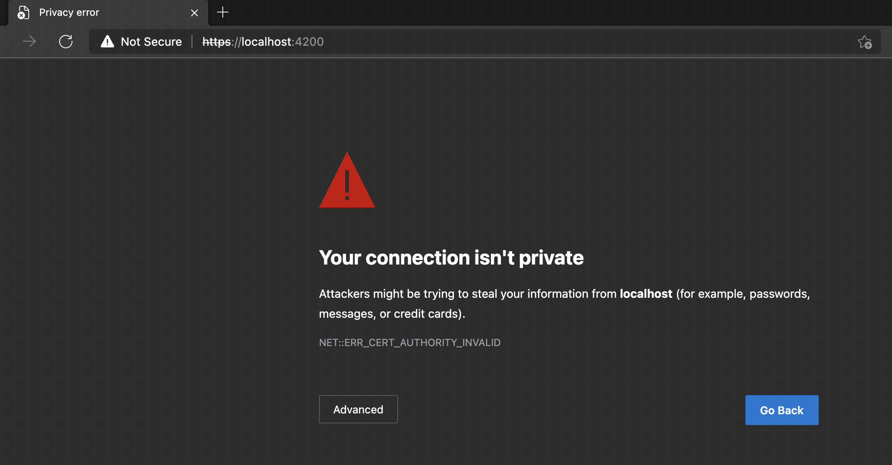
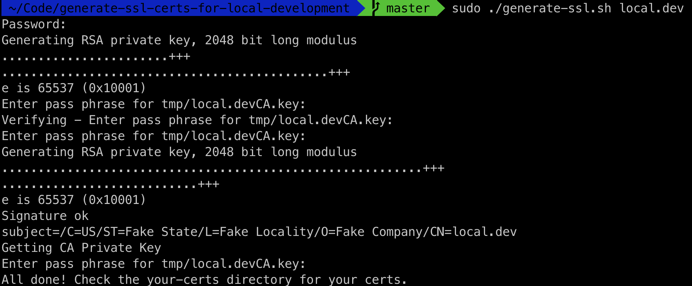
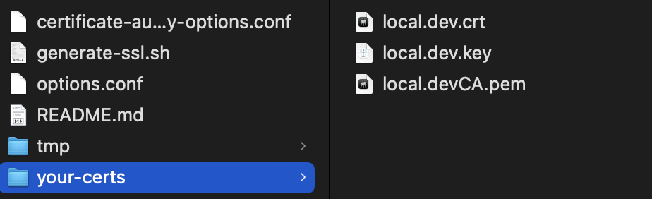
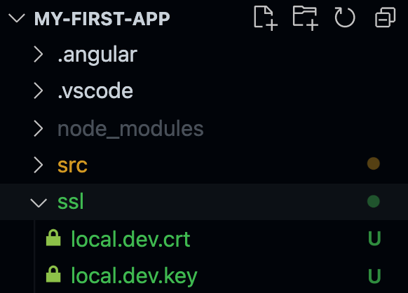
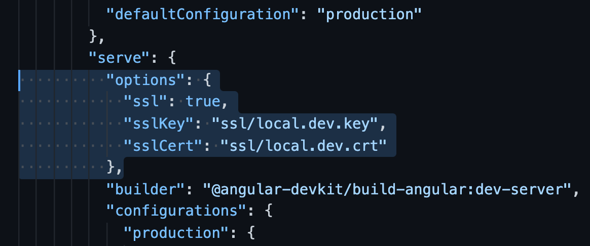
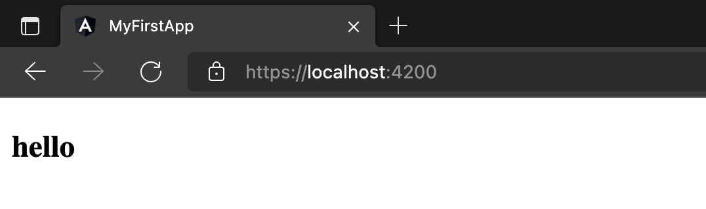

+++
title = "如何配置Angular项目访问本地HTTPS"
slug = "angular-local-https"
date = 2026-04-10T00:00:00-04:00
summary = "在开发过程中, 难免会遇到需要通过 https 进行安全通信的情况. 例如, 使用第三方的登入验证(大部分的登录验证都需要 https)."
readingTime = 1
+++



在开发过程中, 难免会遇到需要通过 https 进行安全通信的情况. 例如, 使用第三方的登入验证(大部分的登录验证都需要 https). 所以为了满足这个需求, 在本地开发测试的时候, 也需要使用 https. 这篇文章主要是想简单记录一下, 如何配置 Angular 使用 Local SSL 的过程.

### 配置方法1

**你可以通过 Angular 自动帮你生成 SSL 证书:**

- 启动 Angular serve 的时候, 使用 `--ssl` 参数
- `ng serve --ssl`
- 或者在 `angular.json` 里添加 `"ssl": true`
- 例如: `"serve": { "options": { "ssl": true } }`

通过此方法, Angular 在第一次启动时, 会自动生成一个有效期为**1个月**的 SSL 证书. 但是当你访问 `https://localhost:4200/` 的时候, 会出现以下错误:

这个错误是因为 Angular 生成的 SSL 证书是自签名证书, 并不被浏览器承认. 我们可以通过安装 SSL 证书来解决这个问题, 因为我并没有使用这个配置方法, 所以请参考[这篇文章](https://deliciousbrains.com/ssl-certificate-authority-for-local-https-development/), 里面详细介绍了如何安装 SSL 证书.

### 配置方法2

**你可以先创造一个 SSL 证书, 然后告诉 Angular 使用你创造的证书.**

#### 1. 生成 SSL 证书并安装

有很多种方法可以自己生成 SSL 证书, 在这里我推荐这个仓库:

[GitHub - A bash script for generating trusted self-signed SSL certs for local development on your Mac](https://github.com/kingkool68/generate-ssl-certs-for-local-development)

这个仓库帮你生成 SSL 证书, 在生成证书后, 帮你安装证书到你的电脑. 根据仓库的文档, 运行脚本:

- 脚本会需要系统密码
- 在输入系统密码后, 下一个需要的密码是为了生成证书, 这个密码可以随便输入, 只要每次输入的时候都是一样的密码就没问题

等脚本完成后, 在仓库目录下会生成一个 `your-certs` 的文件夹:

#### 2. 配置 angular.json

因为我们将会使用自己的 SSL 证书, 所以我们需要让 Angular 知道. 进入你的 Angular 项目, 在根目录下新建一个文件夹, 里面储存我们刚刚生成的两个证书文件:

- `local.dev.crt`
- `local.dev.key`

然后在 `angular.json` 里面, 告诉 server 我们需要使用 SSL, 并给予密匙和证书的路径:

#### 3. 验证 HTTPS

完成上述后, 我们就可以在本地使用 https 了!

---

### 总结

HTTPS 是趋势, SSL 证书也将成为必不可少的安全工具. 如何保证自己的信息隐私以及数据安全, 是每个开发者在开发新的项目的时候, 都需要考虑的问题. 

最后, 如果这篇文章对你有帮助, 也欢迎你和我一起交流, 共同进步.
