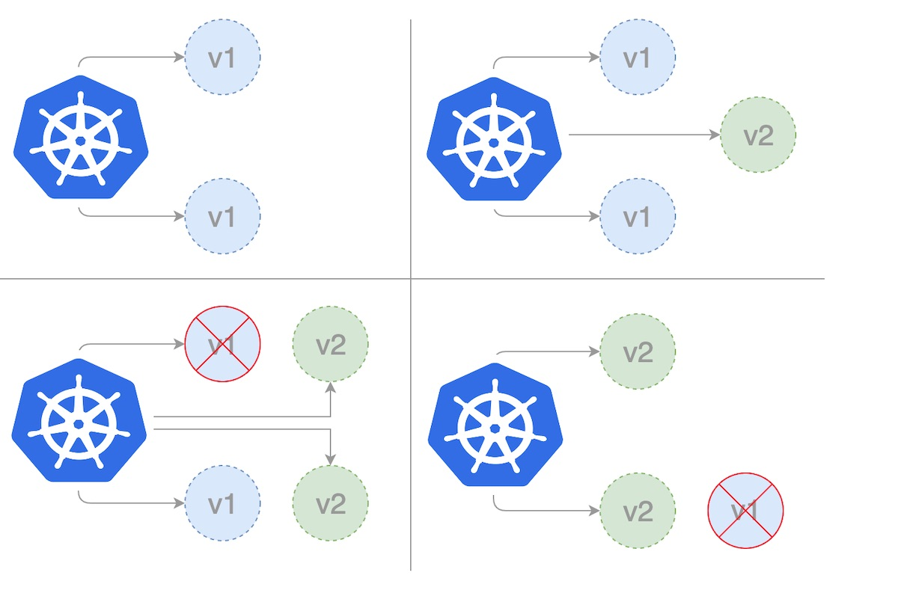

+++
title = "GCP - 使用Cloud Build与Spring Boot的健康探针实现滚动部署"
slug = "cloudbuild-probe"
date = 2026-04-10T00:00:00-04:00
summary = "这篇博客介绍了如何在GCP上使用Google的CI/CD服务 Cloud Build, 配合相应的 Spring Boot k8s 健康探针, 实现 GCP GKE 的滚动部署."
readingTime = 3
+++



这篇博客介绍了如何在GCP上使用Google的CI/CD的服务Cloud Build, 配合相应的Spring Boot [k8s健康探针](https://docs.spring.io/spring-boot/reference/actuator/endpoints.html#actuator.endpoints.kubernetes-probes), 实现GCP GKE的滚动部署.

最近因为工作技术变更, 需要从现有的Cloud Server逐步转移到Google Cloud上面. 从而接触了一些GCP提供的服务:

- **[GCP](https://cloud.google.com/)** - Google Cloud Platform是由Google提供的云计算服务, 在GCP上可以使用一系列的模块云服务, 例如云计算, 数据存储, 数据分析等.
- **[GKE](https://cloud.google.com/kubernetes-engine)** - Google Kubernetes Engine是由Google进行管理的托管式容器化应用服务. 当使用GKE时, 开发者可以在Google的基础架构上进行部署, 管理, 和扩缩容器化应用.
- **[Cloud Build](https://cloud.google.com/build)** - GCP提供的CI/CD服务, 通过相应配置可实现一键完成持续集成/持续部署, 搭配GKE与其他技术可让DevOps的工作更加简洁和高效.

---

就像一般的k8s一样, GKE也是将Rolling Update Deployment (滚动部署) 作为默认的部署模式. GKE同时也提供了[不同的部署策略](https://docs.cloud.google.com/kubernetes-engine/docs/concepts/best-practices-continuous-integration-delivery-kubernetes), 例如Recreate和 Blue/Green.

要实现滚动更新, 我们需要引入Spring Boot的健康探针, 并使k8s的部署文件包括健康指针. 这样当新的应用系统被部署时, k8s会检查新的应用系统的健康状况. 当没有发现问题时, k8s会逐步的将旧的应用系统替换为新的, 从而实现应用系统的部署与更新. 在此过程中用户并不会发觉应用的更新, 也就是说用户的体验是平滑的.

### 关于滚动部署:

在部署更新的过程中, 并不会一下子就部署所有的新应用. 而是先部署一个新版本, 再停止一个老版本, 再部署一个新版本, 再停止一个老版本... 直到完成所有的新版本部署.

滚动部署的逻辑:

- 当前k8s集群中应用部署的版本为V1
- 正在进行的新的应用部署版本为V2
- V2启动完成且无问题
- 淘汰V1, 并将流量和相应配置指向V2
- 进行相同的部署逻辑, 直到k8s集群中所有的应用都完成更新
- 滚动部署完成



滚动部署的优点:
- 部署更新过程体验影响较少, 风险较小
- 相比于Blue/Green部署, 花费的资源较少, 相同的集群不需要部署两套

滚动部署的缺点:
- 回滚时间慢
- 需要监控新的部署应用
- 上线时间不统一 
	- 因为滚动部署是逐步更新应用系统, 所以会短暂的出现新老版本不一致的情况

### 关于Spring Boot k8s健康指针:

- 启动探针 : Startup Probe
  - 判断新的容器是否启动完成
  - 如果配置了Startup Probe, 将会禁用所有其他指针, 直到StartupProbe成功为止
  	- 如果StartupProbe失败, k8s将会终止容器, 容器将根据重启策略进行重启
  - 如果没有配置StartupProbe, 容器启动状态为默认状态 **Success**. 当应用需要更长时间才能启动完成时, 容器会永远达不到Liveness Probe检测成功的状态, 从而进入无限重启的循环
  - StartupProbe可以确保应用在容器启动过程中的状态, 减少不必要的重启, 从而提高应用的可靠性
- 存活探针 : Liveness Probe
  - 判断当下的容器是否能够正常响应. 一旦容器无响应或有错误发生, 容器会被认为是不健康的状态, k8s会终止不健康的容器, 并重新启动一个新的容器
- 就绪探针 : Readiness Probe
  - 判断当下的容器是否已经准备好提供服务
  	- 如果没有准备好, k8s不会将请求转发给该容器
  - 应用可能会因为加载数据或者配置, 或启动后需依赖外部服务才能就绪. 在这种情况下, k8s既不想终止该应用, 也不想转发请求, 所以就绪指针就非常重要了

### 所需要的改动

在了解完以上信息后, 接下来我们进入代码的改动:

*开始之前, 首先确认你已经将源代码从代码仓库或云储存空间导入到Cloud Build. 
其次, 你已经可以通过Cloud Build完成单次的应用部署到GKE.*

在Spring Boot的应用里面, 引入Spring Boot Actuator的依赖:

```xml
<dependency>
  <groupId>org.springframework.boot</groupId>
  <artifactId>spring-boot-starter-actuator</artifactId>
</dependency>
```

在`application-profile`配置里面, 设置并启用健康指针:

```text
management.endpoint.health.probes.enabled=true
management.health.livenessState.enabled=true
management.health.readinessState.enabled=true
```

在k8s部署文件 `.yml` 里面, 包括Spring Boot健康指针:

```yaml
apiVersion: apps/v1
kind: Deployment
metadata:
  name: spring-boot-actuator-app
spec:
  selector:
    matchLabels:
      app: spring-boot-actuator-app
  replicas: 2
  template:
    metadata:
      labels:
        app: spring-boot-actuator-app
    spec:
      containers:
        - name: spring-boot-actuator-app
          image: spring-boot-actuator-app:0.0.1
          imagePullPolicy: Always
          ports:
            - containerPort: 8080
              name: http
          startupProbe:
            httpGet:
              path: /actuator/health/liveness
              port: 8080
            initialDelaySeconds: 10
            periodSeconds: 30
            successThreashold: 1
            failureThreashold: 5
          livenessProbe:
            httpGet:
              path: /actuator/health/liveness
              port: 8080
            initialDelaySeconds: 3
            periodSeconds: 30
            successThreashold: 1
            failureThreashold: 5
          readinessProbe:
            httpGet:
              path: /actuator/health/readiness
              port: 8080
            initialDelaySeconds: 3
            periodSeconds: 30
            successThreashold: 1
            failureThreashold: 5
```
---

**Startup Probe:**

```text
startupProbe:
  httpGet: (使用HTTP协议)
  path: /actuator/health/liveness (用liveness来检查startup的状态)
  port: 8080 (容器端口)
  initialDelaySeconds: 10 (让k8s等待10秒后开始第一次检查)
  periodSeconds: 30 (每隔30秒检查一次)
  successThreashold: 1 (1次检查成功后就认为该容器为正常状态)
  failureThreashold: 5 (连续5次检查失败后根据restartPolicy决定是否重启)
```

在容器启动后, k8s等待10秒后开始第一次检查, 然后每隔30秒检查一次. 

如果连续5次检查失败, 或如果容器在 **5 * 30 = 150** 秒都不能启动成功, k8s则会根据restartPolicy决定是否需要重启该容器.

**Liveness Probe:**

```text
livenessProbe:
  httpGet: (使用HTTP协议)
  path: /actuator/health/liveness (liveness路径)
  port: 8080 (容器端口)
  initialDelaySeconds: 3 (让k8s等待3秒后开始第一次检查)
  periodSeconds: 30 (每隔30秒检查一次)
  successThreashold: 1 (1次检查成功后就认为该容器为正常状态)
  failureThreashold: 5 (连续5次检查失败后, 标记该容器状态为Unhealthy)
```

在容器启动后, k8s等待3秒后开始第一次检查, 然后每隔30秒检查一次. 

如果连续5次检查失败, 该容器会被标记为**Unhealthy**, k8s则会终止该容器, 然后根据restartPolicy决定是否需要重启新容器.

**Readiness Probe:**

```text
readinessProbe:
  httpGet: (使用HTTP协议)
  path: /actuator/health/readiness (readiness路径)
  port: 8080 (容器端口)
  initialDelaySeconds: 3 (让k8s等待3秒后开始第一次检查)
  periodSeconds: 30 (每隔30秒检查一次)
  successThreashold: 1 (1次检查成功后就认为该容器为正常状态)
  failureThreashold: 5 (连续5次检查失败后, 标记该容器状态为Unready)
```

在容器启动后, k8s等待3秒后开始第一次检查, 然后每隔30秒检查一次. 

如果连续5次检查失败, 该容器会被标记为**Unready**, k8s并不会对Unready的容器进行重启操作, 但也不会向这个容器发送任何请求.

---

因为GKE默认的部署模式是滚动更新, 所以当重新部署之后, 使用 `kubectl rollout restart` 就可完成新的应用部署, 在Cloud Build `.yaml` 里面的改动就非常简单了.

```text
  - name: someBaseImage:
    id: App Deployment to GKE Cluster - Rolling Update
    entrypoint: 'bash'
    args:
      - - c
      - l

      someEnvironmentConfig

      echo "Deploying Work-Load to GKE..."

      kubectl apply -f deployment.yml

      kubectl rollout deployment/spring-boot-actuator-app

      kubectl rollout status deployment/spring-boot-actuator-app

      kubectl rollout history deployment/spring-boot-actuator-app
```

`kubectl rollout restart deployment/someApp` 重启现有的容器 - 对于新部署的容器来说, 当新容器启动后没有问题时, 把旧的容器替换成新的容器.

`kubectl rollout history deployment/someApp` 查看someApp之前部署的版本(容器的部署历史记录).

`kubectl rollout status deployment/someApp` 查看someApp的当前状态.

`kubectl rollout status deployment/someApp -w` 监控someApp的状态直到rollout结束.

`kubectl rollout undo deployment/someApp` 回滚到之前的部署版本.

`kubectl rollout status deployment/someApp --to-version=2` 回滚到指定版本-2.

[重要参数](https://www.bluematador.com/blog/kubernetes-deployments-rolling-update-configuration): `maxSurge` / `maxUnavailable`

`maxSurge` 滚动部署过程中运行的最大容器数量, 不能为0:

- 可以为百分比, 例如50%, 默认值为25%
- 换句话说, `maxSurge` is the maximum number of new pods that will be created at a time
- 假如`maxSurge`=1, 表示滚动部署时会先升级和部署1个容器

`maxUnavailable` 滚动部署过程中不可用的最大容器数, 不能为0:

- 可以为百分比, 例如50%, 默认值为25%
- 换句话说, `maxUnavailable` is the maximum number of old pods that will be deleted at a time

---

### 总结

在GCP平台上通过Cloud Build+GKE可以实现快速的高效的一键式容器部署和回滚, 熟练的运用Spring Boot提供的健康探针可以使部署的Java容器以最健康的状态在k8s上工作. 如果你的项目涉及DevOps且与GCP有接触, 我相信掌握这些技术可以更好的帮助你在工作或日常中完成所需要的任务.

最后, 如果这篇文章对你有帮助, 也欢迎你和我一起交流, 共同进步.
