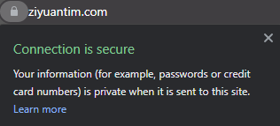
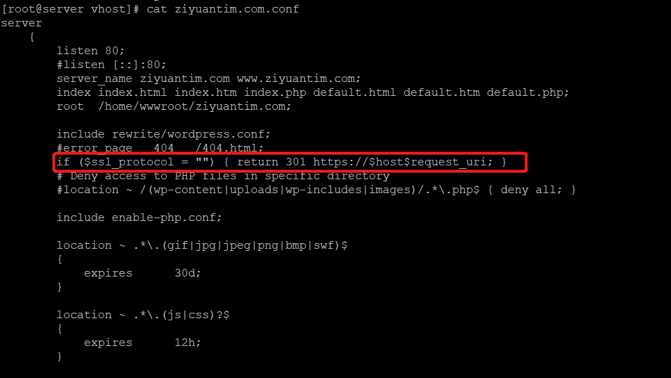

+++
title = "LNMP 环境下为网站启用 SSL 证书"
slug = "lnmp-ssl"
+++



在前段时间完成了网站的搭建后，因为太忙(懒)一直没有时间维护站点，直到前段时间抽空把域名换了（之后也会分享域名更改的过程），才想起网站安全问题，最近把这个简单的事完成了。

<!--more-->


此篇博客只是记录博主通过LNMP脚本为站点添加免费的SSL证书 - Let's Encrypt ，希望对你有所帮助！

## HTTPS，SSL，TLS之间的关系
大家都应该听说过HTTP吧？当你输入一个网址时, 通常这个网址开始于**http**://某个网址.com。HTTP又称**Hypertext Transfer Protocol**，或[超文本传输协议](https://www.wikiwand.com/zh/%E8%B6%85%E6%96%87%E6%9C%AC%E4%BC%A0%E8%BE%93%E5%8D%8F%E8%AE%AE) - 是万维网(www)数据通信的基础。

HTTPS， 它与HTTP在本质上是相同的：都是通过超文本协议将数据呈现在你的电脑屏幕上，但是相比于HTTP，HTTPS更先进，也更加安全。 HTTPS通过SSL，确切说是SSL的大哥**TLS (Transport Layer Security)** 保证了通信链接的私密性，信息完整性和身份认证。
 - TLS只是一个更新的，更安全的SSL版本，但是因为SSL是一个更常用的术语，所以一般我们仍然将证书称为SSL。

**SSL** (**Secure Sockets Layer** ) 是基于**HTTPS**下的一个安全协议层，SSL可确保互联网链接安全，保护两个终端之间发送的任何敏感数据。

当某个网站安装了SSL证书，且更新了服务器配置 [实现HTTP跳转HTTPS](#http跳转问题)之后，网站网址就不再是以http开始了，而是升级为https，代表此网站收到SSL的保护，在网站上的所有数据信息的交互都是经过了加密。

##### 相关文章：
- [SSL,TLS,HTTPS终极指南](https://www.websecurity.digicert.com/zh/cn/security-topics/what-is-ssl-tls-https)
- [什么是SSL证书](https://www.kaspersky.com.cn/resource-center/definitions/what-is-a-ssl-certificate)

## 添加SSL
进入你的server，运行LNMP添加SSL证书命令

`lnmp ssl add`

```
[root@server tmp]# lnmp ssl add

+-------------------------------------------+
| Manager for LNMP, Written by Licess       |
+-------------------------------------------+
| https://lnmp.org                          |
+-------------------------------------------+

Please enter domain(example: www.lnmp.org):
ziyuantim.com

Your domain:
ziyuantim.com

Enter more domain name(example: lnmp.org *.lnmp.org):
www.ziyuantim.com

domain list:
www.ziyuantim.com

Please enter the directory for domain ziyuantim.com:
/home/wwwroot/ziyuantim.com

Allow Rewrite rule? (y/n)
y

Please enter the rewrite of programme, wordpress,discuzx,typecho,thinkphp,laravel,codeigniter,yii2
rewrite was exist. (Default rewrite: other):
wordpress

You choose rewrite:
wordpress

Allow access log? (y/n)
y

Enter access log filename(Default:ziyuantim.com.log):

You access log filename:
ziyuantim.com.log

Enable PHP Pathinfo? (y/n)
y

Enable pathinfo.

1: Use your own SSL Certificate and Key
2: Use Let's Encrypt to create SSL Certificate and Key

Enter 1 or 2:
2

It will be processed automatically.

```

根据提示填写所需要的信息，如域名，网址等。在这里我们不需要购买SSL证书，而是使用免费的 Let's Encrypt证书。当所有选择完成后，我们只需要等了。

看到以下信息表示SSL证书已经安装完成

`Reload Nginx......`

这时候如果我们去浏览器输入HTTPS格式的网址，如 [https://ziyuantim.com](https://ziyuantim.com)，发现网址旁边有个小锁头，代表SSL证书已经生效。



### HTTP跳转问题

因为网站默认的访问网址是HTTP，即使已经添加了SSL证书，当你以HTTP继续访问网站时，你的网站仍然不受SSL保护。这时候我们就要修改Nginx的设置 - 当以HTTP访问网站时，自动跳转为HTTPS。

首先找到并且打开对应站点的conf 文件:

`cd /usr/local/nginx/conf/vhost`

`vim ziyuantim.com.conf`

在conf文件中80模块区域中，添加一下脚本

`if ($ssl_protocol = "") { return 301 https://$host$request_uri; }`

添加完成后结果如图：



之后就重启Nginx即可

`lnmp nginx reload`

重启完成后，测试是否成功：用HTTP网址访问网站时，会发现网址已经成为HTTPS。

## 总结
1. 当使用LNMP脚本进行网站搭建时，可选择安装免费的SSL证书Let's Encrypt。
2. 凡是都有两面性 - SSL可以提高网站的安全性，但同时也会降低网站的性能。
    -  没有SSL不会影响网站运行。
3. 添加SSL证书之后，需要手动设置Nginx配置，达到强制HTTPS访问的目的。
