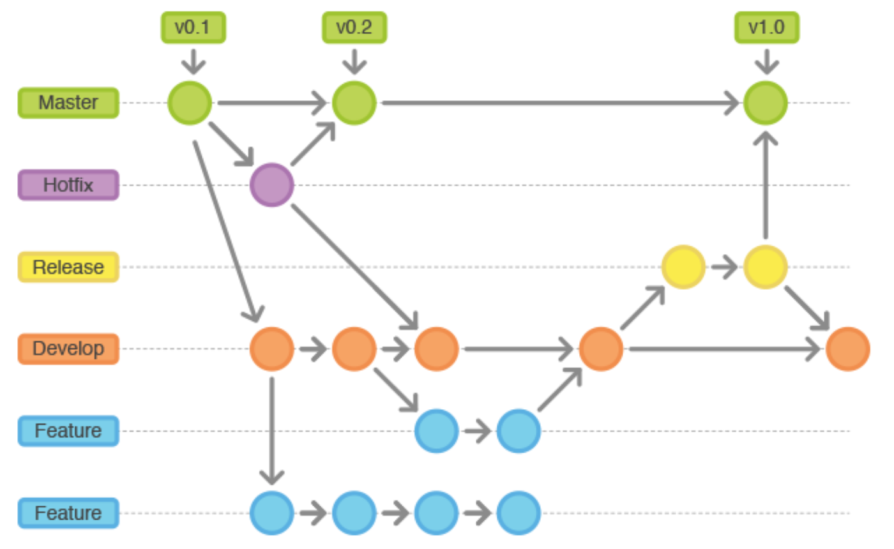

+++
title = "VCS，Git分支策略与我的常用命令"
slug = "vcs-git-command"
date = 2026-05-20T00:00:00-04:00
summary = "这篇博客介绍了版本控制系统 VCS、常见 Git 分支策略，以及我在日常开发中常用的 Git 命令。"
readingTime = 3
aliases = ["/2026/git-vcs/", "/2026/vcs-git-branch-strategy-common-commands/"]
+++



作为一名程序员，不可避免的会与[版本控制系统](https://www.wikiwand.com/zh-hans/%E7%89%88%E6%9C%AC%E6%8E%A7%E5%88%B6)- VCS（Version Control System）打交道。当下最流行的分布式版本控制系统是[Git](https://git-scm.com/)。

## 关于版本控制VCS

VCS是一类用于记录项目文件变更历史的系统 / 工作流，主要的目的是为了在项目的推进过程中，对项目的变更进行记录，跟踪，和多人协作。 

那我们为什么要用VCS呢？可以先想象一个没有VCS的场景: 

> 一个团队把所有项目文件都放在同一个共享文件夹里。假如你正在修改一个文件 `account.csv`, 另一个成员也需要修改同一个文件。
>
> 你需要通知其他成员: “我现在在改这个文件, 大家先别动。“
>
> 等你改完之后, 还要再通知别人: “我改完了, 其他人可以继续了。”
>
> 你也许会问，为什么需要通知他人呢？
>
> 因为如果两个人同时修改同一个文件，后保存的人会直接覆盖之前保存的修改，且不留痕迹！
	
这是没有 VCS 时最灾难的场景，你辛辛苦苦的工作成果，被别人覆盖掉了，但是是谁造成的都不知道。这显然是一种不现实也不高效的工作流程。

当我们使用了VCS之后，每个团队成员可以在各自创建的分支 branch中对项目文件进行修改。修改完成后, 成员会把这次变更保存成一次 commit。然后通过VCS把所有分支的改动通过提交 push, 拉取 pull, 拉取请求 pull request (PR)，合并 merge, 等操作，合并成一个共同的版本。

通过 VCS, 我们可以看到某次变更是谁提交的, 在什么时候提交的, 修改了哪些文件, 具体修改了哪些内容。

VCS与项目的种类，使用的技术和应用的工具并无关系：无论是开发一个后端微服务，一个iOS应用，一个前端网站，还是维护一份技术文档，它的核心思想都是一样的: 
- 记录变更
- 管理历史
- 支持协作

## 分支策略

正确的使用VCS是一个开发人员必备的技能。每个团队都有不同的分支管理策略，但大体可以分为两种

- [Git flow](https://nvie.com/posts/a-successful-git-branching-model/)
- [GitHub flow](https://docs.github.com/en/get-started/using-github/github-flow)

### 我所使用的分支策略

目前我接触的分支策略属于Git flow，主要特征有这些：

长期分支（Long-lived branches）
  
- master – 主分支，对应线上稳定版本

- develop – 开发分支，集成所有已完成的功能

短期分支（Short-lived branches）
- feature – 功能分支，从 develop 拉出，完成后合并回 develop

- release – 发布分支，从 develop 拉出，测试后合并到 master 和 develop

- hotfix – 补丁分支，从 master 拉出，修复后合并到 master 和 develop

Pull Request (PR)： 通过创建 PR，分支可以合并到其他分支。一些重要分支会被保护, 例如master或develop分支。被保护的分支不能随意直接推送改动。

### 我是如何使用VCS开发与常用的Git命令

虽然市面上有很多可视化的VCS软件，如[Tower](https://www.git-tower.com/)，[Sourcetree](https://www.sourcetreeapp.com/)，还有GitHub自己出品的[GitHub Desktop](https://github.com/apps/desktop)，但我个人还是更偏向于使用命令行进行操作。

我在工作中使用VCS和Git命令的场景 - 当有新功能需要开发时，我会按以下步骤操作：

>首先，我会使用 `git status` 确认当前工作区是否干净，再用 `git branch -vv` 确认当前所在分支。如果不在 develop 分支，我会用 `git checkout develop` 切换到 develop 分支，然后执行 `git pull` 拿到最新的代码。
>
>接着，我会从 develop 分支创建一个新的功能分支（例如 new_feature_branch），命令为 `git checkout -b new_feature_branch`。
>
>在开发过程中，可能会遇到紧急 bug 需要修复，而新功能只开发到一半。这时我会用 `git stash push -u -m "feature inprogress"` 保存所有修改。保存之后，我就可以切换到其他分支去修复 bug。
>
>修复完 bug 后，我会切回功能分支：`git checkout new_feature_branch`。然后用 `git stash list` 查看所有保存的进度，再用 `git stash apply` 恢复最近的开发进度。
>
>当新功能开发完成，准备提交代码时，我会先用 `git status` 查看哪些文件被修改，再用 `git diff` 查看修改的细节。确认无误后，我会用 `git add <file_name>` 逐个将文件添加到暂存区。
>
>之后，我会用 `git commit -m "commit message"` 将暂存区的所有修改提交到本地仓库。
>
>在推送之前，为了减少冲突，我会先切换到 develop 分支执行 `git pull`，然后切回功能分支执行 `git merge develop`（如有冲突则解决）。
>
>最后，我会用 `git push -u origin new_feature_branch` 将本地功能分支推送到远程仓库。

### 命令详解：

+ `git status`： 查看当前工作区和暂存区的状态

+ `git branch -vv`： 显示本地分支, 最近一次 commit, 以及远程跟踪分支的信息

+ `git checkout develop`:  切换到develop分支

+ `git pull`： 从远程仓库获取更新, 并整合到当前分支

+ `git checkout -b new_feature_branch` : 在本地创造并切换到一个名为 new_feature_branch的分支

+ `git stash push -u -m "some message"`: 临时保存当前本地未提交的修改, 包括已被 Git 跟踪的文件和未被 Git 跟踪的新文件, 并添加一个注释为 "some messages"

+ `git stash apply` ： 恢复之前保存的文件修改状态，默认为最近一次的修改
    
+ `git stash list`： 显示通过`git stash`保存进度的列表
  + `stash@{0}` 表示最近一次 stash。
  + `stash@{1}` 表示上一次 stash。

+ `git status`： 查看本地文件的修改情况

+ `git diff` ： 查看在工作区中，尚未进入暂存区的已修改文件的细节 

+ `git add <file_name>`： 将指定文件的修改添加到暂存区，使其包含在下次提交中。

+ `git commit -m "some commit message"`： 将暂存区中的所有修改提交到本地仓库，并附加提交信息。

+ `git merge develop`: 将develop分支合并到当前分支

+ `git push -u origin new_feature_branch`： 将本地的feature分支new_feature_branch推送远端仓库，并建立 upstream 跟踪关系

---

## 总结

在日常工作中，VCS的操作不仅仅是我所提到的这些，其他常见涉及VCS的场景有：代码合并，合并冲突，版本重置，分支管理等。所有我提到的指令也有更详细更具体的[用法](https://git-scm.com/docs)

一般来说, 每个团队都会根据自己的项目规模, 发布节奏和协作方式制定一套分支策略。作为团队成员, 最重要的是理解这套流程背后的目的, 并遵守团队约定的开发规范。

最后，如果这篇文章对你有帮助，也欢迎你和我一起交流，共同进步。
